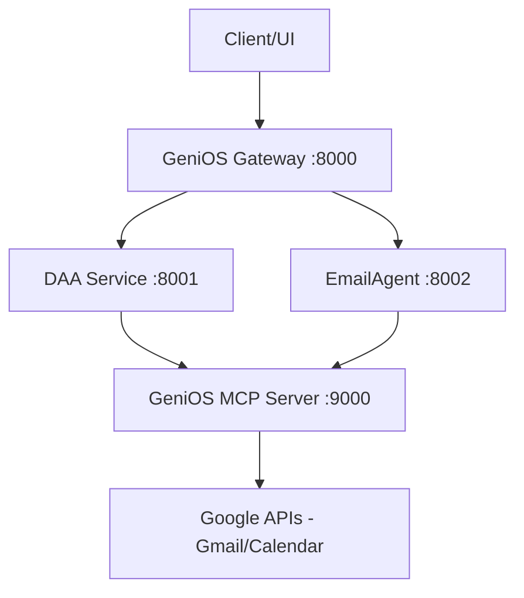

# GeniOS AI Agents 🧠🤖

Welcome to **GeniOS AI Agents**, a high-performance suite of intelligent, autonomous agents designed to streamline personal and professional workflows. Built with **Gemini 2.5 Flash**, **LangGraph**, and a distributed service architecture, GeniOS provides state-of-the-art reasoning, structured execution, and long-term semantic memory.

---

## 🚀 Current Status: Service-Oriented Architecture (v2.0)

The project has evolved into a robust, multi-service architecture to ensure scalability, reliability, and local control. We have successfully migrated from external tool dependencies (Zapier) to a **Self-Hosted GeniOS MCP Server**.

### 🏗️ Architecture Overview



### 1. 📧 EmailAgent (V1.2)
A comprehensive Gmail assistant that goes beyond simple automation.
- **Intelligent Classification**: Automatically categorizes incoming mail by Sender Type, Intent, and Priority.
- **RAG-Powered Drafting**: Uses **Supabase (pgvector)** to remember your writing style and past interactions.
- **Safety First**: Triple-guardrail protection (PII scanning, Domain validation, Tone enforcement).

### 2. 📅 Daily Attention Agent (V2.0)
Your read-only Executive Assistant for a focused start to the day.
- **Self-Hosted Tooling**: Now powered by the GeniOS MCP server for direct Google API access.
- **Signal Analysis**: Aggregates and scores data from Gmail and Google Calendar.
- **Risk Detection**: Flags calendar conflicts, overloaded schedules, and security alerts.
- **Executive Briefing**: Generates a concise "Attention List" of high-priority items.

---

## 🛠️ Tech Stack

| Component | Technology |
| :--- | :--- |
| **Frontend** | Streamlit (Python UI) |
| **LLMs** | Gemini 2.5 Flash, Gemini 1.5 Pro |
| **Orchestration** | LangGraph (Stateful Workflows) |
| **Gateway** | FastAPI + httpx (Proxying & Routing) |
| **MCP Server** | Python + Google API Client (OAuth2) |
| **Memory** | Supabase + pgvector (Semantic Retrieval) |
| **APIs** | Google Workspace (Gmail, Calendar) |

---

## 📂 Project Structure

```text
.
├── frontend/                 # Streamlit UI (Port 8501)
├── gateway/                  # Unified Entry Point (Port 8000)
├── daily_attention_agent/    # DAA Logic Service (Port 8001)
├── mcp_server/               # Self-Hosted Tool Server (Port 9000)
├── EmailAgent/               # Gmail Drafting Agent (Port 8002)
├── requirements.txt          # Root dependencies
└── README.md                 # This file
```

---

## ⚙️ Getting Started

### 1. Prerequisites
- Python 3.10+
- Google Cloud Project with Gmail/Calendar APIs enabled.
- OAuth 2.0 Desktop Credentials (`credentials.json`).

### 2. Setup
```bash
# 1. Install root dependencies
pip install -r requirements.txt

# 2. Configure environment
# Ensure .env exists in daily_attention_agent/ and root.
# Place credentials.json in mcp_server/
```

### 3. Running the Services
To run the full GeniOS stack, start the services in separate terminals:

```bash
# Terminal 1: MCP Server (Tool Access)
bash mcp_server/start.sh

# Terminal 2: DAA Service (Logic)
cd daily_attention_agent && bash uvicorn_start.sh

# Terminal 3: Gateway (Unified API)
bash gateway/start.sh

# Terminal 4: Frontend (UI)
bash frontend/start.sh
```

---

## 🎯 Upcoming Milestones

1. **Unified Web Interface**: Migration of CLI tools to a premium **Next.js** dashboard.
2. **Cross-Agent Coordination**: Enabling shared context between DAA and EmailAgent via the Gateway.
3. **Slack/Jira Integration**: Expanding the signal sources in the MCP Server.
4. **Advanced Evaluation**: Implementing an Evals pipeline to measure agent performance.

---

*GeniOS: Intelligence where it matters most.*
